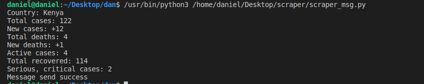
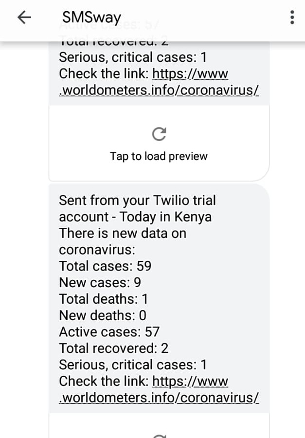

# V1 Selenium webscraper
## Webscraper
This is a basic webscrapper built with python and selenium that collects real-time covid19 data from [here](https://www.worldometers.info/coronavirus/) .Building on the scrapper i use Twilio SMS-API to send the scraped data via SMS to verified phonenumbers. Twilio is not a free service but they provide a trial account with some credit. In order to get started, we need to make an account in [Twilio.](https://www.twilio.com/try-twilio) Grab your Account SID and auth token from your Twilio account console.If you are on a Twilio Trial account, your outgoing SMS messages are limited to phone numbers that you have verified with Twilio. Phone numbers can be verified via your Twilio Console's Verified Caller IDs.

## Running locally
### Clone the repository 
```bash
git clone git@github.com:DanNduati/covid19-Kenya.git
```
```bash
cd old_scripts/
```
### Install dependencies
```bash
pip install -r requirements.txt
```

### Run the scripts
Web scraper script
```bash
python scraper.py
```
Web scraper script with sms 
```bash
python scraper_msg.py
```
# Outcome

</img>

---

</img>
